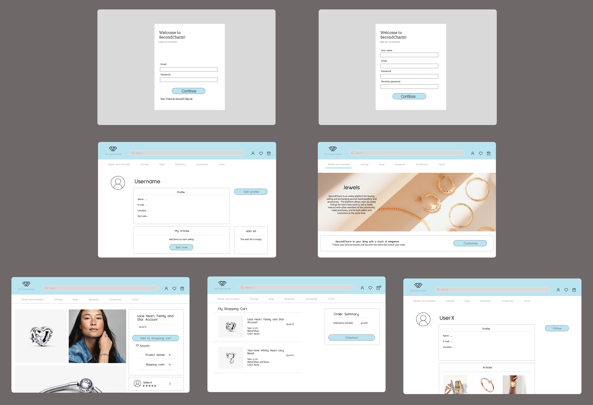
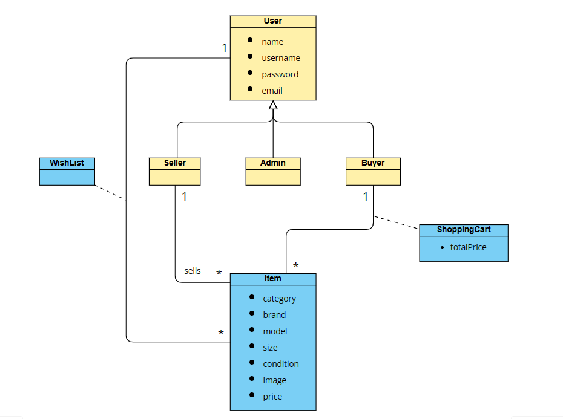

# SecondCharm: LTW Project

## Project made by:
- [Bernardo Costa](https://github.com/berno9)
- [Sofia Gonçalves](https://github.com/SofiaX5)
- [Teresa Mascarenhas](https://github.com/teresaam7)

---

 Welcome to the documentation pages of SecondCharm! 
You can find here details about our website.

* [Mockups](#Mockups) 
* [Domain Model](#Domain-Model) 
* [Features](#Features) 
* [Languages Used](#Languages-Used)

## Mockups

  

## Domain Model

  

## Features

- [x] Register
- [x] Login/Logout
- [x] Edit Profile
- [x] Sellers can list new items, providing details
- [x] Sellers can print shipping forms for items that have been sold out
- [x] Buyers can brouse using filters related to the details of the items
- [x] Buyers can add items to wish list and shopping cart
- [x] The process payment is simulated when buyers proceed to checkout with theis shopping cart
- [x] Admins can give and take the admin status of other users
- [x] Admins can delete and introduce new categories, conditions, sizes, and other properties to the site
- [x] The users can rate other users
- [x] Buyers and sellers are able to communicate throught a real-time messaging system

## Languages Used
* HTML
* CSS
* PHP
* JavaScript
* Ajax/ JSON
* SQLite
