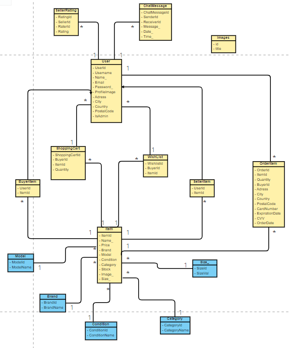

# SecondCharm: LTW Project

## Project made by:
- [Bernardo Costa](https://github.com/berno9)
- [Sofia Gonçalves](https://github.com/SofiaX5)
- [Teresa Mascarenhas](https://github.com/teresaam7)

---

 Welcome to the documentation pages of SecondCharm! 
You can find here details about our website.

* [Mockups](#Mockups) 
* [Domain Model](#Domain-Model) 
* [Features](#Features) 
* [Languages Used](#Languages-Used)

## Mockups

  

## Domain Model

  

## Features

- [x] Register
- [x] Login/Logout
- [x] Edit Profile

## Languages Used
* HTML
* CSS
* PHP
* JavaScript
* SQLite
